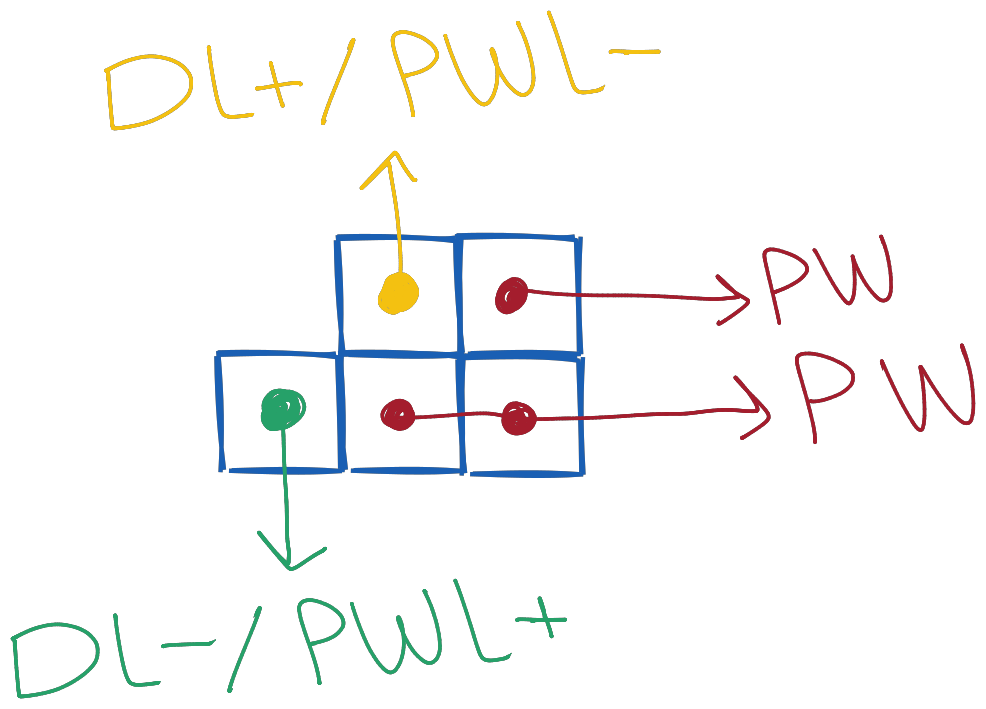

**Dell 5-Pin Power Connector Diagram**

The pinout diagram for the Dell 5-pin power switch connector is as follows:

**Diagram:** 

**Understanding the Pin Configuration:**

As you can see from the diagram, the power button and LED connections are straightforward. However, there's a nuance to be aware of when it comes to the LED connections.

**LED Connection Note:**

The positive lead for the power LED is connected to the negative lead of the diagnostic LED, and vice versa. This means that if you connect an LED to one port, it will illuminate, but connecting it in reverse will illuminate a different LED. Unfortunately, this design doesn't allow both LEDs to be lit up at the same time.

**Solutions for Specific Scenarios:**

* **Standard Motherboard in Dell Case:**
	+ You have two options:
		- Use either the power LED or HDD LED as a power indicator.
		- The power LED is blue, and the diagnostic LED is yellow. Choose one to suit your needs.
* **Dell Motherboard in Custom Case:**
	+ You can connect the diagnostic LED to the HDD LED since they will only light up when something is amiss with your system.

**Hope this Helps!**
